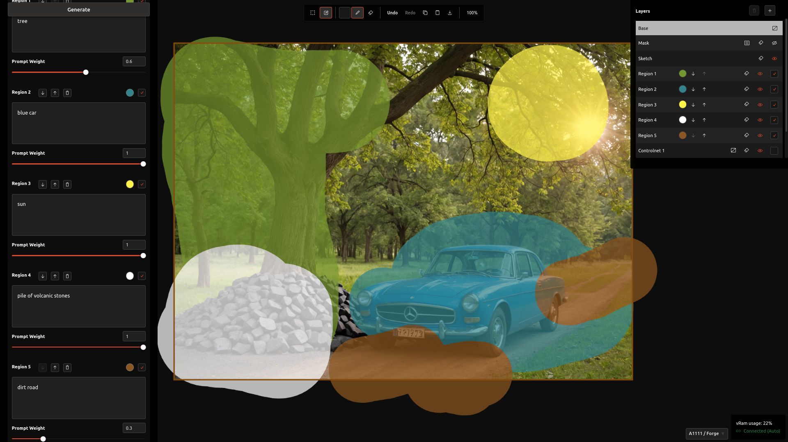
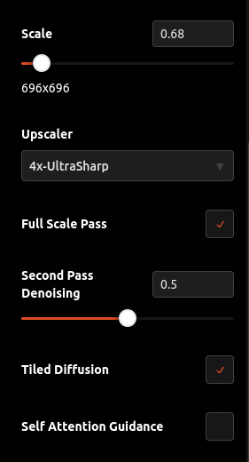
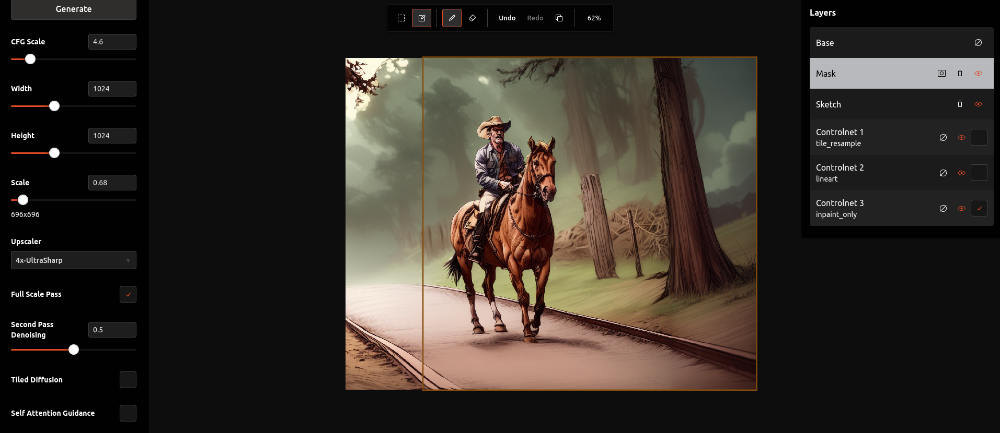
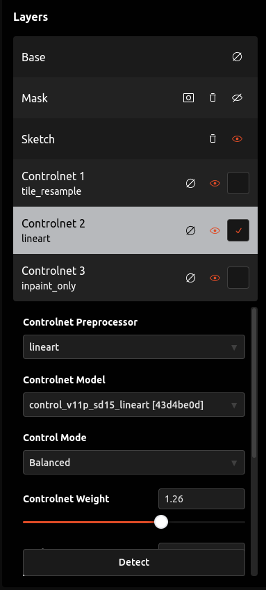
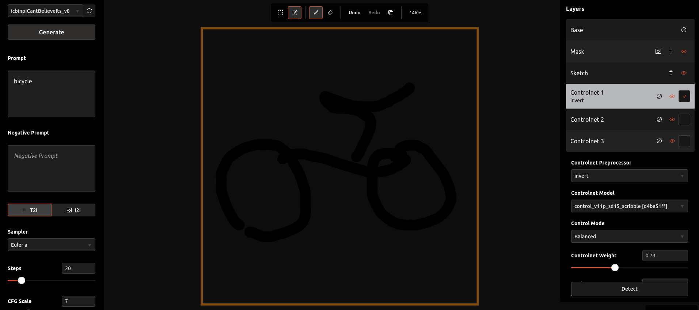
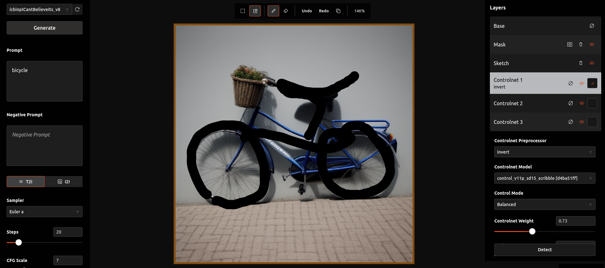
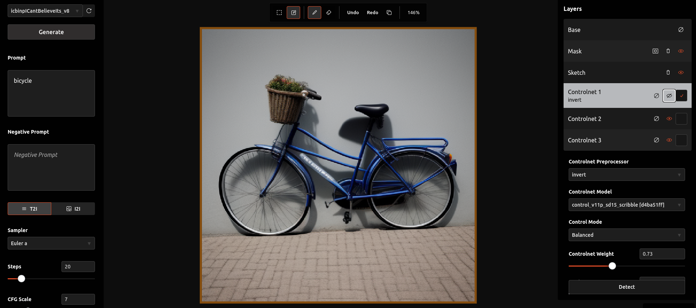
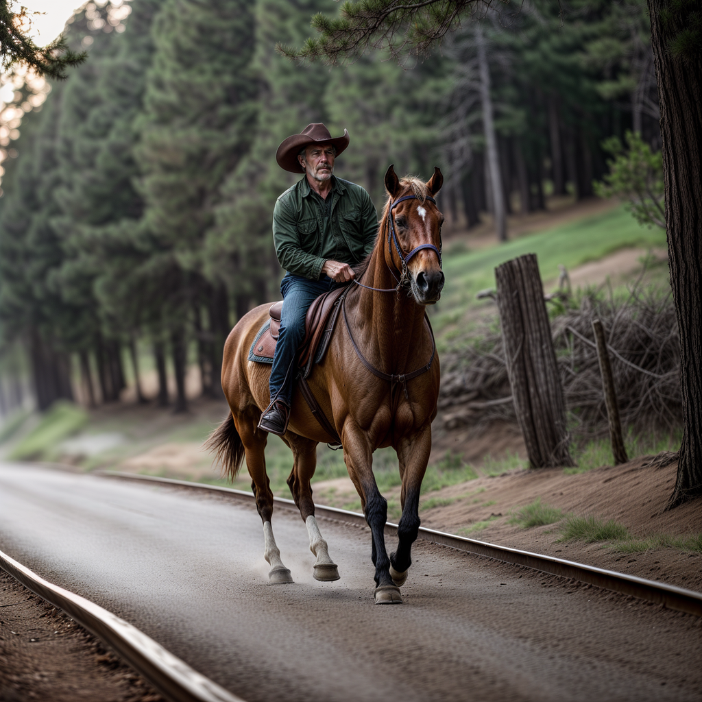
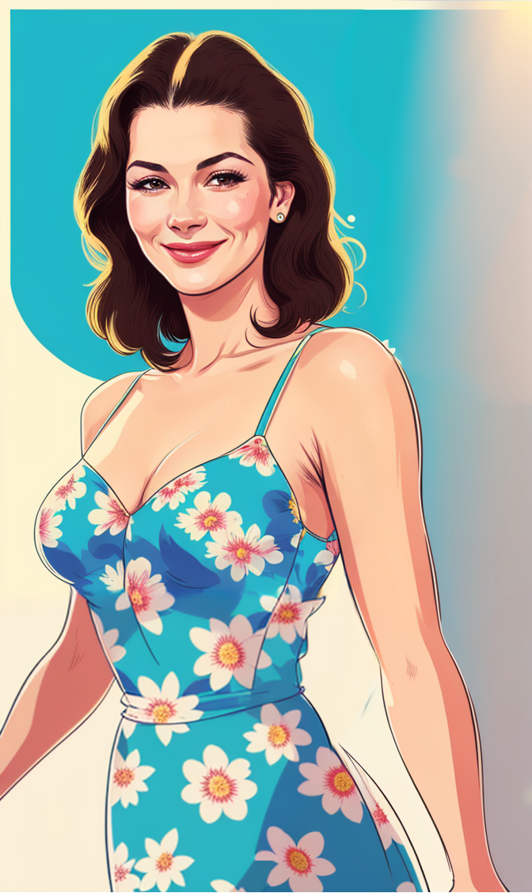

# A8R8 (Alternate Reality)

An opinionated interface for SD (Stable Diffusion) image generation, and more.

&nbsp;

*Unified interface*

&nbsp;

- [A8R8 (Alternate Reality)](#a8r8-alternate-reality)
  - [Features](#features)
  - [Getting started](#getting-started)
    - [Installation](#installation)
    - [Running](#running)
    - [Updating](#updating)
  - [Key Shortcuts](#key-shortcuts)
  - [Development Environment](#development-environment)
  - [Sample Generations](#sample-generations)

&nbsp;

## Features

- Works with existing [A1111](https://github.com/AUTOMATIC1111/stable-diffusion-webui) SD installation; **NO NEED** to reinstall yet another SD implementation
- Runs in browser
- Full [Controlnet](https://github.com/Mikubill/sd-webui-controlnet) support
- Open canvas with unified interface
- Inpainting/Outpainting with masking and scaling 
- VRam usage info
- Scaling and hires like built in solution
- Integration with [TiledVAE](https://github.com/pkuliyi2015/multidiffusion-upscaler-for-automatic1111), [Tiled Diffusion](https://github.com/pkuliyi2015/multidiffusion-upscaler-for-automatic1111) and [Self Attention Guidance](https://github.com/ashen-sensored/sd_webui_SAG)
- Sketch, mask and Controlnet layers
- Image info support (on import only for now)
- Text editor with auto complete for installed LORAs & embeddings
- Color picker for mask color and brush color
- Edit detection map on canvas
- Copy support for base layer and copy/paste support for CN layers
- Drag and drop images from disk
- On canvas generation live preview
- Initial support for synchronized sessions across tabs/machines connected to the same server
- Potential to add any A1111 extension in the future

&nbsp;

[A1111](https://github.com/AUTOMATIC1111/stable-diffusion-webui) has deservedly held it's place as the go to SD tool, it's awesome and everyday there're amazing new integrations and extensions, however, the interface leaves somethings to be desired.

A8R8 has been in the making for the past few months, and I tried to make it as intuitive as possible. It's not meant to be a full image editor nor a beginner's tool; it's more of an opinionated power tool.

&nbsp;

A lot more to come, this is just starting!

&nbsp;

\
*Scaling controls*

&nbsp;

*Outpainting / Inpainting*

&nbsp;

\
*Layers*

&nbsp;

*Scribbling*

&nbsp;

*Scribble over canvas*

&nbsp;

*Toggle layer visibility*

&nbsp;

## Getting started

### Installation

1. Install [Automatic1111 webui](https://github.com/AUTOMATIC1111/stable-diffusion-webui#installation-and-running) if you haven't yet
2. Install [Docker Compose](https://docs.docker.com/compose/gettingstarted/)
3. Clone this repo and open a terminal at the root directory
4. Run `docker compose build`
5. Start Automatic1111 webui and make sure to add `--listen` to `COMMANDLINE_ARGS` under `webui-user.sh` or `webui-user.bat` depending on the operating system

### Running

1. Run `docker compose up`

### Updating

1. Run `docker compose build`
2. Run `docker compose up`

## Key Shortcuts

Key/Combo/Action | Fuctionality
---------|----------
 `-` | zoom out canvas
 `+` | zoom in canvas
 `1` | reset zoom
 `Middle Mouse Button click` | pan canvas
 `[` | decrease brush size
 `]` | increase brush size
 `← → ↑ ↓ arrows` + `SHIFT` | move selection box and increase movement amount by pressing shift
 `s` | toggle selection box and paint modes
 `t` | toggle tool between brush and eraser
 `p` | toggle brush color selector
 `h` | hide mask layer
 `c` | clear mask, sketch or controlnet brush strokes of the active layer
 `m` | toggle between mask and sketch layers
 `CTRL + z` | undo generation image addition, mask paint, sketch paint
 `CTRL + SHIFT + z`, `CTRL + y`| redo generation image addition, mask paint, sketch paint
 `CTRL + c`| copy image to clipboard within selection box bounds from the base layer
 `CTRL + v`| paste image from clipboard at the selection box top left corner position to the base or active controlnet layer. Generation info will be applied if found when pasting to base layer
 `CTRL + s`| save image within selection box bounds to disk
 `Drop PNG image to canvas` | add image at the selection box top left corner position to the base or active controlnet layer. Generation info will be applied if found when pasting to base layer

## Development Environment

To be added...

&nbsp;

&nbsp;

## Sample Generations

&nbsp;

&nbsp;

&nbsp;

\
*Outpainting in hires*