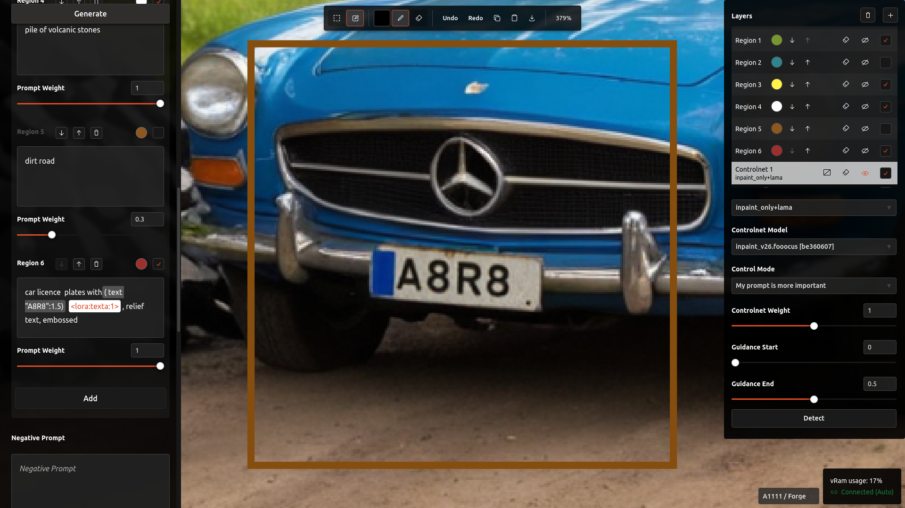
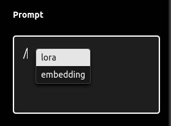

# A8R8 (Alternate Reality)

An opinionated interface for SD (Stable Diffusion) image generation, and more.

Links: [[Discord](https://discord.gg/RzdGa839MK)]

&nbsp;

*Unified interface*

&nbsp;

- [A8R8 (Alternate Reality)](#a8r8-alternate-reality)
  - [Features](#features)
  - [Getting started](#getting-started)
    - [Installation](#installation)
      - [One-Click Windows WSL2 (**RECOMMENDED**)](#one-click-windows-wsl2-recommended)
      - [Docker](#docker)
      - [Windows (EXPERIMENTAL / BROKEN)](#windows-experimental--broken)
      - [Mac](#mac)
      - [Linux (Debian based)](#linux-debian-based)
    - [Running](#running)
      - [One-Click Windows WSL2](#one-click-windows-wsl2)
      - [Docker](#docker-1)
      - [Windows (EXPERIMENTAL / BROKEN)](#windows-experimental--broken-1)
      - [Linux (Debian based)](#linux-debian-based-1)
    - [Updating](#updating)
      - [One-Click Windows WSL2](#one-click-windows-wsl2-1)
      - [Docker](#docker-2)
      - [Windows (EXPERIMENTAL / BROKEN)](#windows-experimental--broken-2)
      - [Mac \& Linux (Debian based)](#mac--linux-debian-based)
  - [Key Shortcuts](#key-shortcuts)
  - [Development Environment](#development-environment)
  - [Sample Generations](#sample-generations)

&nbsp;

## Features

- Works with existing [Forge](https://github.com/lllyasviel/stable-diffusion-webui-forge), [A1111](https://github.com/AUTOMATIC1111/stable-diffusion-webui) and [ComfyUI](https://github.com/comfyanonymous/ComfyUI) SD installations; **NO NEED** to reinstall yet another SD implementation
- Runs in browser
- Full [Controlnet](https://github.com/Mikubill/sd-webui-controlnet) support
- Controlnet mask layers with Forge
- Attention mask layers with Forge & [Forge Couple](https://github.com/Haoming02/sd-forge-couple)
- Open canvas with unified interface
- Inpainting/Outpainting with masking and scaling
- VRam usage info
- Scaling and hires like built in solution
- Integration with [TiledVAE](https://github.com/pkuliyi2015/multidiffusion-upscaler-for-automatic1111), [Tiled Diffusion](https://github.com/pkuliyi2015/multidiffusion-upscaler-for-automatic1111) and [Self Attention Guidance](https://github.com/ashen-sensored/sd_webui_SAG)
- Integration with Ultimate Scale with [A1111](https://github.com/Coyote-A/ultimate-upscale-for-automatic1111) and [ComfyUI](https://github.com/ssitu/ComfyUI_UltimateSDUpscale)
- Sketch, mask and Controlnet layers
- Image info support (on import only for now)
- Text editor with auto complete for installed LORAs & embeddings
- Color picker for mask color and brush color
- Edit detection map on canvas
- Copy support for base layer and copy/paste support for CN layers
- Drag and drop images from disk
- On canvas generation live preview
- Initial support for synchronized sessions across tabs/machines connected to the same server
- Potential to add any A1111 extension in the future

&nbsp;

&nbsp;

\
*Editor autocomplete for LORAs and embeddings*

&nbsp;

\
*Scaling controls*

&nbsp;

*Outpainting / Inpainting*

&nbsp;

\
*Layers*

&nbsp;

*Scribbling*

&nbsp;

*Scribble over canvas*

&nbsp;

*Toggle layer visibility*

&nbsp;

## Getting started

### Installation

**Update - 2024/04/07: Added one-click installer or Windows (WSL2), check [installation steps](#one-click-windows-wsl2-recommended) for details.**

**Update:** Added one click installer for Windows `install-docker.ps1`, check [installation steps](#docker) for details.

Keep in mind this hasn't been tested, please report any issues [here](https://github.com/ramyma/a8r8/discussions/5)

#### One-Click Windows WSL2 (**RECOMMENDED**)

1. Install [Forge](https://github.com/lllyasviel/stable-diffusion-webui-forge?tab=readme-ov-file#installing-forge) and/or[Automatic1111 webui](https://github.com/AUTOMATIC1111/stable-diffusion-webui#installation-and-running) and/or [ComfyUI](https://github.com/comfyanonymous/ComfyUI)  if you haven't yet
2. Download latest One-Click Installer from [latest release](https://github.com/ramyma/a8r8/releases/latest) or[one-click-installer-wsl.bat](https://github.com/ramyma/a8r8/raw/main/one-click-installer-wsl.bat) and [install.sh](https://github.com/ramyma/a8r8/raw/main/install.sh) in the folder you want to install the application in
3. Go to the folder where you downloaded the files
4. Right click within the folder and choose `Open in Terminal`
5. Run `.\one-click-installer-wsl.bat`
6. Set the user name and password if it's your first time using it. Make sure you remember the password you entered
7. Once the installation completes, you can open the generated `a8r8` folder
8. To start the application open `run-windows.bat` (preferably in a terminal to see the output logs)
9. Start the SD backend of your choice
   1. Forge/Automatic1111 webui and make sure to add `--api --listen` to `COMMANDLINE_ARGS` under `webui-user.sh` or `webui-user.bat` [depending on the operating system](https://github.com/AUTOMATIC1111/stable-diffusion-webui/wiki/Command-Line-Arguments-and-Settings#webui-user)
   2. [ComfyUI](https://github.com/comfyanonymous/ComfyUI)
      1. Install [A8R8 supporting nodes](https://github.com/ramyma/A8R8_ComfyUI_nodes)
      2. Add `--preview-method auto --listen` to the run command, ex: `python main.py --preview-method auto --listen`
      3. Install <https://github.com/ssitu/ComfyUI_UltimateSDUpscale>
      4. Install <https://github.com/Fannovel16/comfyui_controlnet_aux>
      5. Install <https://github.com/Kosinkadink/ComfyUI-Advanced-ControlNet>

&nbsp;

>**NOTE**:
To use regional prompting with Forge, make sure to install the [Forge Couple](https://github.com/Haoming02/sd-forge-couple) extension >= v1.5.0 to your Forge installation

>**NOTE**:
If you're running the stable diffusion backend (Forge / A1111 / ComfyUI) on a remote machine, make sure to set the remote address in `user.sh` and uncomment the URL entries.

&nbsp;

#### Docker

1. Install [Automatic1111 webui](https://github.com/AUTOMATIC1111/stable-diffusion-webui#installation-and-running) and/or [ComfyUI](https://github.com/comfyanonymous/ComfyUI)  if you haven't yet
2. Clone this repo and open a terminal at the root directory
3. On Windows you can run `install-docker.ps1` in a powershell window (**recommended**) or:
   1. Install [Docker Compose](https://docs.docker.com/compose/gettingstarted/)
   2. Run `docker compose build`
4. Start the SD backend of your choice
   1. Automatic1111 webui and make sure to add `--api --listen` to `COMMANDLINE_ARGS` under `webui-user.sh` or `webui-user.bat` [depending on the operating system](https://github.com/AUTOMATIC1111/stable-diffusion-webui/wiki/Command-Line-Arguments-and-Settings#webui-user)
   2. [ComfyUI](https://github.com/comfyanonymous/ComfyUI)
      1. Install [A8R8 supporting nodes](https://github.com/ramyma/A8R8_ComfyUI_nodes)
      2. Add `--preview-method auto --listen` to the run command, ex: `python main.py --preview-method auto --listen`
      3. Install <https://github.com/ssitu/ComfyUI_UltimateSDUpscale>
      4. Install <https://github.com/Fannovel16/comfyui_controlnet_aux>
      5. Install <https://github.com/Kosinkadink/ComfyUI-Advanced-ControlNet>

&nbsp;

#### Windows (EXPERIMENTAL / BROKEN)

1. Clone this repo and open a terminal at the root directory
2. Run `install.ps1` in a powershell window

&nbsp;

#### Mac

1. Download latest One-Click Installer from [latest release](https://github.com/ramyma/a8r8/releases/latest) 
2. Run `xcode-select --install` to install developer tools, and follow the installation prompts
3. Install Homebrew from https://brew.sh/ 
4. Run `CLONE_REPO=true ./install-mac.sh` (preferably from a terminal window)

_Or_

1. Run `xcode-select --install` to install developer tools, and follow the installation prompts
2. Install Homebrew from https://brew.sh/ 
3. Clone repo
4. Run `./install-mac.sh` within the cloned directory (preferably from a terminal window)
  
&nbsp;
  
Start the SD backend of your choice
   1. Automatic1111 webui and make sure to add `--api --listen` to `COMMANDLINE_ARGS` under `webui-user.sh` or `webui-user.bat` [depending on the operating system](https://github.com/AUTOMATIC1111/stable-diffusion-webui/wiki/Command-Line-Arguments-and-Settings#webui-user)
   2. [ComfyUI](https://github.com/comfyanonymous/ComfyUI)
      1. Install [A8R8 supporting nodes](https://github.com/ramyma/A8R8_ComfyUI_nodes)
      2. Add `--preview-method auto --listen` to the run command, ex: `python main.py --preview-method auto --listen`
      3. Install <https://github.com/ssitu/ComfyUI_UltimateSDUpscale>
      4. Install <https://github.com/Fannovel16/comfyui_controlnet_aux>
      5. Install <https://github.com/Kosinkadink/ComfyUI-Advanced-ControlNet>

&nbsp;

#### Linux (Debian based)

1. Download latest One-Click Installer from [latest release](https://github.com/ramyma/a8r8/releases/latest) 
2. Run `CLONE_REPO=true ./install.sh`

_Or_

1. Clone repo
2. Run `./install.sh`
  
&nbsp;
  
Start the SD backend of your choice
   1. Automatic1111 webui and make sure to add `--api --listen` to `COMMANDLINE_ARGS` under `webui-user.sh` or `webui-user.bat` [depending on the operating system](https://github.com/AUTOMATIC1111/stable-diffusion-webui/wiki/Command-Line-Arguments-and-Settings#webui-user)
   2. [ComfyUI](https://github.com/comfyanonymous/ComfyUI)
      1. Install [A8R8 supporting nodes](https://github.com/ramyma/A8R8_ComfyUI_nodes)
      2. Add `--preview-method auto --listen` to the run command, ex: `python main.py --preview-method auto --listen`
      3. Install <https://github.com/ssitu/ComfyUI_UltimateSDUpscale>
      4. Install <https://github.com/Fannovel16/comfyui_controlnet_aux>
      5. Install <https://github.com/Kosinkadink/ComfyUI-Advanced-ControlNet>

&nbsp;

>**NOTE**:
To use regional prompting with Forge, make sure to install the [Forge Couple](https://github.com/Haoming02/sd-forge-couple) extension >= v1.5.0 to your Forge installation

>**NOTE**:
If you're running the stable diffusion backend (Forge / A1111 / ComfyUI) on a remote machine, make sure to set the remote address in `user.sh` and uncomment the URL entries.

&nbsp;

### Running

#### One-Click Windows WSL2

1. Make sure you followed the [installation steps](#windows-wsl2-recommended)
2. Go to the folder where you cloned the repo
3. Right click within the folder and choose `Open in Terminal`
4. Run `run-windows.bat`
5. Run your stable diffusion backend (Forge/A1111/Comfy)

&nbsp;

#### Docker

On Windows you can run `run-docker.ps1` in a powershell window

_Or_

Run `docker compose up`

&nbsp;

Point your browser to [http://localhost:4000](http://localhost:4000), it's preferred to use a chromium based browser (Brave, Chromium, Chrome)

&nbsp;
&nbsp;

#### Windows (EXPERIMENTAL / BROKEN)

1. Run `run.ps1` in a powershell window

Keep in mind this hasn't been tested, please report any issues [here](https://github.com/ramyma/a8r8/discussions/5)

Update: one of the dependencies doesn't work with Windows at the moment, so it won't run successfully

&nbsp;

#### Linux (Debian based)

Run `./run.sh`

&nbsp;

### Updating

#### One-Click Windows WSL2

1. Run `update-windows.bat`

#### Docker

On Windows you can run `install-docker.ps1` in a powershell window

Or

1. Run `git pull`
2. Run `docker compose build`

#### Windows (EXPERIMENTAL / BROKEN)

1. Run `install.ps1` in a powershell window
2. Keep in mind this hasn't been tested, please report any issues [here](https://github.com/ramyma/a8r8/discussions/5)

Update: one of the dependencies doesn't work with Windows at the moment, so it won't run successfully

&nbsp;

#### Mac & Linux (Debian based)

Run `./update.sh`

&nbsp;
&nbsp;

## Key Shortcuts

Key/Combo/Action | Fuctionality
---------|----------
 `-` | zoom out canvas
 `+` | zoom in canvas
 `1` | reset zoom
 `Middle Mouse Button click` | pan canvas
 `[` with optional `CTRL` or `Shift` for fine control| decrease brush size
 `]` with optional `CTRL` or `Shift` for fine control| increase brush size
 `← → ↑ ↓ arrows` + `SHIFT` | move selection box and increase movement amount by pressing shift
 `s` | toggle selection box and paint modes
 `t` | toggle tool between brush and eraser
 `p` | toggle brush color selector
 `h` | hide mask layer
 `c` | clear mask, sketch or controlnet brush strokes of the active layer
 `m` | toggle between mask and sketch layers
 `CTRL + z` | undo generation image addition, mask paint, sketch paint, or any layer brush stroke
 `CTRL + SHIFT + z`, `CTRL + y`| redo generation image addition, mask paint, sketch paint, or any layer brush stroke
 `CTRL + c`| copy image to clipboard within selection box bounds from the base layer
 `CTRL + v`| paste image from clipboard at the selection box top left corner position to the base or active controlnet layer. Generation info will be applied if found when pasting to base layer
 `CTRL + s`| save image within selection box bounds to disk
 `Drop PNG image to canvas` | add image at the selection box top left corner position to the base or active controlnet layer. Generation info will be applied if found when pasting to base layer

## Development Environment

To be added...

&nbsp;

&nbsp;

## Sample Generations

&nbsp;

&nbsp;

&nbsp;

&nbsp;

&nbsp;

&nbsp;

\
*Outpainting in hires*
